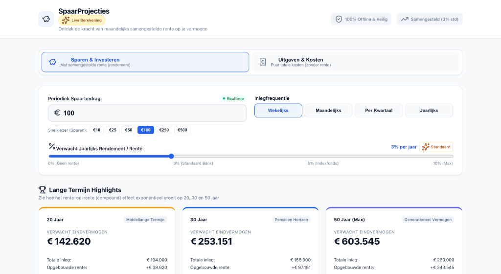
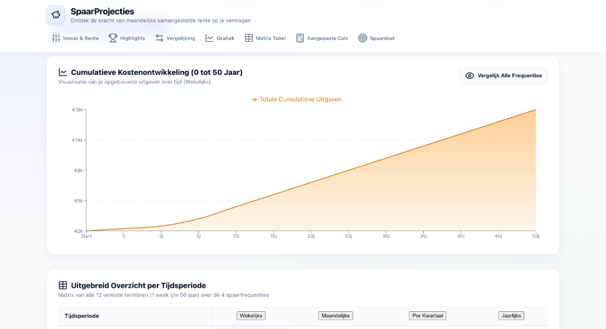
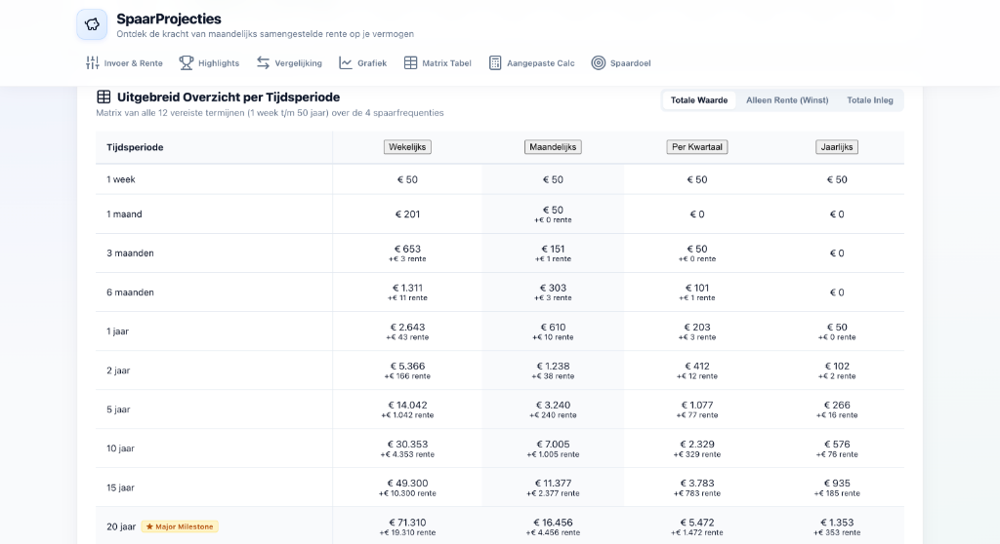

# Spaar Projecties 📈

[](https://react.dev/)
[](https://www.typescriptlang.org/)
[](https://vite.dev/)
[](https://vitest.dev/)
[](https://github.com/parvenuprompting/spaarprojecties)
[](LICENSE)

> Een moderne, type-safe Single Page Application (SPA) voor het berekenen van exacte financiële spaar- en uitgavenprojecties. Gebouwd op een maandelijks samengestelde rente-engine met ondersteuning voor optioneel startkapitaal, per-frequentie stortingstiming, en interactieve data-visualisaties.

---

## 📸 Interface & Features



<div align="center">
  <table>
    <tr>
      <td width="50%">
        
        <p align="center"><b>Interactieve Grafiekvisualisatie (Recharts)</b></p>
      </td>
      <td width="50%">
        
        <p align="center"><b>Sticky Matrix Tabel (1w t/m 50j)</b></p>
      </td>
    </tr>
    <tr>
      <td width="50%" colspan="2">
        
        <p align="center"><b>Uitgaven & Kosten Modus (Abonnementen & Gewoontes)</b></p>
      </td>
    </tr>
  </table>
</div>

---

## ✨ Kernfunctionaliteiten

- 💰 **Exacte Compounding-Engine**: Berekening van maandelijks samengestelde rente ($r_{\text{maand}} = r_{\text{jaar}} / 12$) met exacte stortingsmomenten voor **Wekelijkse**, **Maandelijkse**, **Kwartaal-** en **Jaarlijkse** inleg.
- 💵 **Optioneel Startkapitaal**: Voer een beginbedrag in dat direct rente-dragend meegroeit, met strikte scheiding tussen _Eigen Inleg_ en _Rente Winst_.
- 🎯 **Inverse Spaardoel Calculator**: Voer een gewenst eindbedrag en gewenste looptijd in om exact te berekenen wat de vereiste periodieke inleg moet zijn per frequentie.
- 🧾 **Dual Modus (Sparen vs. Uitgaven)**: Schakel om naar de _Uitgaven & Kosten Modus_ om de cumulatieve impact van maandelijks of wekelijks terugkerende vaste kosten op lange termijn inzichtelijk te maken (0% rente).
- 📊 **Interactieve Data Visualisatie**: Dynamische gebiedsgrafiek (Recharts) met realtime toelichting voor eigen inleg versus samengestelde rente.
- 📋 **Responsive Sticky Matrix Tabel**: Overzicht van 15 tijdsperiodes (1w t/m 50j) en 4 frequenties, inclusief vastgezette eerste kolom (`position: sticky`) voor optimale mobiele weergave.
- 💾 **State Persistence**: Automatische opslag van voorkeuren via `localStorage` met veilige fallback en JSON-validatie.
- ♿ **WAI-ARIA Accessibility**: 100% toetsenbordnavigeerbaar met geldige HTML5 semantiek en duidelijke focus-indicators.

---

## 🏛️ Architectuur & Code Kwaliteit

Het project volgt een **Clean Component Architecture** met strikte scheiding van weergave en berekeningslogica:

```
src/
├── components/          # Puur declaratieve React components
│   ├── CalculatorInput.tsx
│   ├── CustomCalculator.tsx
│   ├── DetailedTable.tsx
│   ├── FrequencyComparison.tsx
│   ├── Header.tsx
│   ├── HighlightCards.tsx
│   ├── ModeToggle.tsx
│   ├── ProjectionChart.tsx
│   └── TargetCalculator.tsx
├── types/               # Type-safe interfaces & enums
│   └── savings.ts
├── utils/               # Pure, deterministische berekeningsfuncties
│   └── savingsCalculator.ts
├── App.tsx              # Central State Hub (Single Source of Truth)
├── index.css            # Custom Modern Banking Design System
└── main.tsx
```

### Belangrijkste Ontwerp-keuzes:

1. **Deterministische Pure Functions**: Alle financiële berekeningen in `savingsCalculator.ts` zijn pure functies zonder side-effects, 100% gedekt door geautomatiseerde unit tests.
2. **Zero Heavy Framework Overhead**: Volledig gestyled met een op maat gemaakt Vanilla CSS Design System met CSS-variabelen, flexbox, grid, glassmorphism-effecten en micro-animaties.
3. **Type-Safety & Strikte Linting**: Geen gebruik van `any` of type ignore hatches. Alle datacontracten zijn strikt vastgelegd in TypeScript interfaces.

---

## 📐 Financiële Formule & Berekeningslogica

De maandelijks samengestelde rente volgt de bancaire standaard:

$$r_{\text{maand}} = \frac{r_{\text{jaar}}}{100 \times 12}$$

Voor een totale looptijd van $M = \text{jaren} \times 12$ maanden:

$$\text{Saldo}_m = (\text{Saldo}_{m-1} + \text{Inleg}_m) \times (1 + r_{\text{maand}})$$

$$\text{Totale Rente} = \text{Saldo}_M - (\text{Startkapitaal} + \text{Periodieke Inleg} \times N)$$

---

## 🧪 Testing & Kwaliteitsborging

Het berekeningsalgoritme is uitvoerig gevalideerd met **Vitest** en **React Testing Library**:

```bash
# Unit tests uitvoeren met gedetailleerde rapportage
npm test -- --reporter=verbose
```

### Gedekte testscenario's:

- ✅ Exacte stortingstiming per kwartaal en jaar t.o.v. maandbasis.
- ✅ Correcte toerekening van startkapitaal t.o.v. opgebouwde rente.
- ✅ Inverse spaardoelberekening (`calculateRequiredDeposit`).
- ✅ Nul-rente uitgavenmodus.
- ✅ Foutloze generatie van de volledige matrix zonder `NaN` of afrondingsfouten.

---

## 📦 Installatie & Lokaal Gebruik

### Vereisten

- Node.js >= 18.0.0
- npm >= 9.0.0

### Stappen

1. **Repository klonen**:

   ```bash
   git clone https://github.com/parvenuprompting/spaarprojecties.git
   cd spaarprojecties
   ```

2. **Afhankelijkheden installeren**:

   ```bash
   npm install
   ```

3. **Ontwikkelomgeving starten**:

   ```bash
   npm run dev
   ```

4. **Productie Build & Type-Check**:
   ```bash
   npm run build
   ```

---

## 📄 Licentie

Gepubliceerd onder de **MIT License**. Zie [LICENSE](LICENSE) voor meer details.
